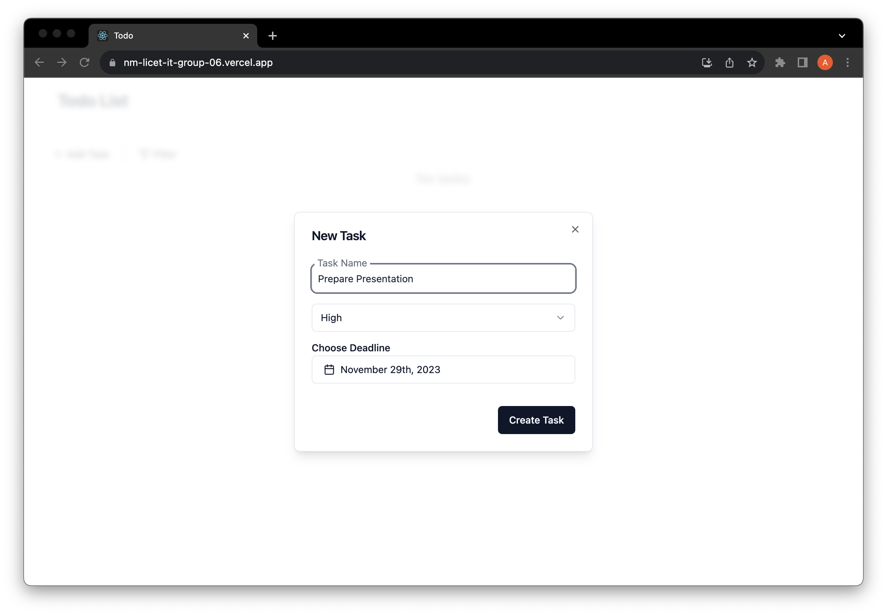
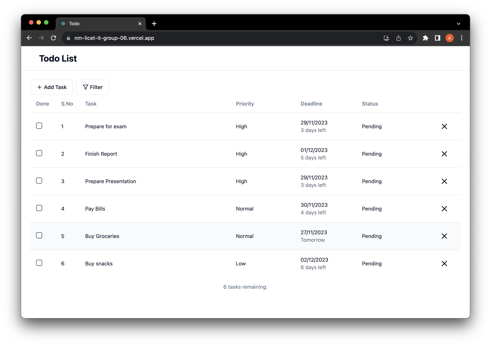
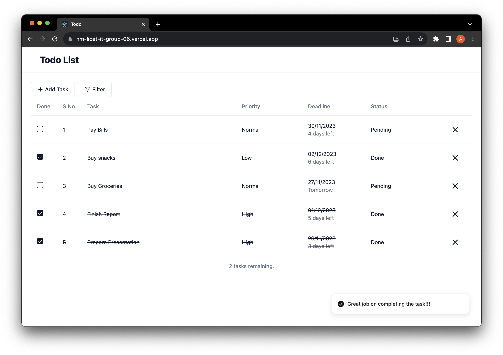
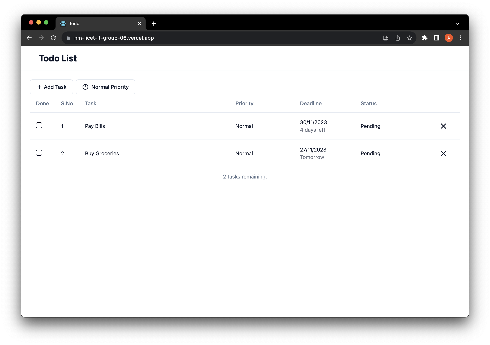
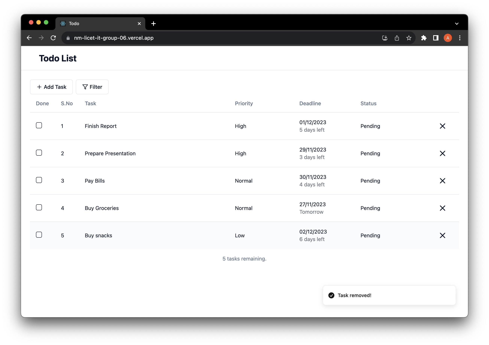

# React Todo Application

This Todo App is a simple web application for managing your tasks. It features a responsive and user-friendly interface built with React for the frontend, a Spring Boot backend for handling API requests, and MongoDB for storing tasks.

## Hosted Links:

https://nm-licet-it-group-06.vercel.app

## Features

- Add new tasks with deadlines and priorities.
- Mark tasks as completed or pending.
- Sort tasks based on priority and deadline.
- Filter tasks based on status, priority, etc.
- Delete tasks when they are no longer needed.

## Technologies Used

- Backend: Java, Spring Boot
- Frontend: React, JavaScript
- Database: MongoDB
- Deployment: Vercel(Frontend), Render(Backend)

## Getting Started

### Prerequisites

- Node.js and npm installed for the frontend.
- Java and Maven installed for the backend.

### Installation

1. Clone the repository.
2. Navigate to the fe directory and run `npm install` to install the frontend dependencies.
3. Navigate to the be directory and run `mvn install` to install the backend dependencies.

## Application Features in Action

### Add or create a task

### All tasks

### Complete a task

### Filter tasks

### Delete a task

